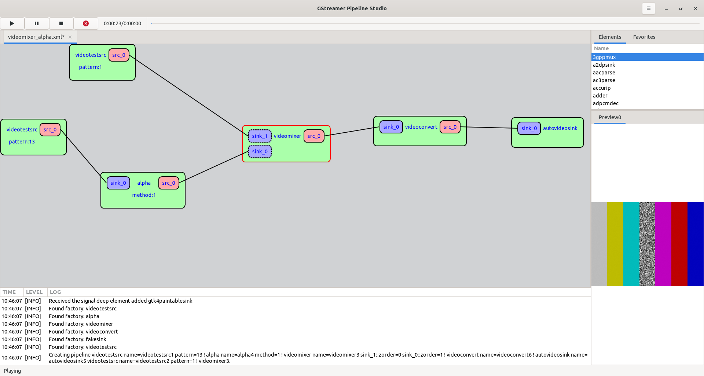

# GstPipelineStudio: Draw your own GStreamer pipeline ...

## Description

GstPipelineStudio aims to provide a graphical user interface to the GStreamer framework. From a first step in the framework with a simple pipeline to a complex pipeline debugging, the tool provides a friendly interface to add elements to a pipeline and debug it.



## Setup

Install the Rust toolchain via `rustup`

```sh
curl --proto '=https' --tlsv1.2 -sSf https://sh.rustup.rs | sh
```

Check https://rustup.rs for alternative installation options.

### Ubuntu/Debian/etc

```sh
apt install python3-pip ninja-build pkgconfig
pip3 install --user meson
apt install libgtk-4-dev libgstreamer1.0-dev libgstreamer-plugins-base1.0-dev
```

### Fedora/RedHat/SuSE/etc

```sh
dnf install python3-pip ninja-build pkgconfig
pip3 install meson
dnf install gtk4-devel gstreamer1-devel gstreamer1-plugins-base-devel python3-pip ninja-build pkgconfig
```

## Getting started

```sh
$ meson builddir -Dbuildtype=release
$ ninja -C builddir
$ ./builddir/target/release/gst_pipeline_studio
```

## Flatpak

The application is also available on [Flathub](https://flathub.org/apps/details/org.freedesktop.dabrain34.GstPipelineStudio).

## License

GstPipelineStudio is distributed under the terms of the GPL3 license.
See LICENSE for more information.

## Credits

GstPipelineStudio wouldn't exist without free and open-source software such as
GLib, GStreamer, GTK and many more.

This project has been also possible thanks to amazing projects such as:

- [pipeviz](https://github.com/virinext/pipeviz)
- [helvum](https://gitlab.freedesktop.org/ryuukyu/helvum)

## Contributing

Every contribution is greatly appreciated! You will just need a [gitlib account](https://gitlab.freedesktop.org/users/sign_in?redirect_to_referer=yes). [Fork](https://docs.gitlab.com/ee/user/project/repository/forking_workflow.html) this repo, [clone](http://git-scm.com/docs/git-clone) your fork, create a [feature branch](https://www.google.com/search?q=git+feature+branches), [commit](http://git-scm.com/docs/git-commit), [push](http://git-scm.com/docs/git-push) and submit a [merge request](https://docs.gitlab.com/ee/user/project/merge_requests/creating_merge_requests.html).

Submit any suggestions, questions or bugs to the [Issue Tracker](https://gitlab.freedesktop.org/dabrain34/GstPipelineStudio/-/issues/).
